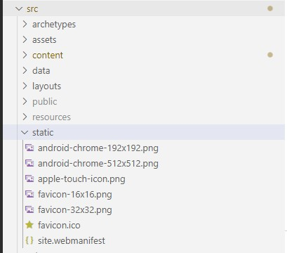

A favicon, which is an abbreviation of the word "favorite icon", is a small icon that helps users visually identify and distinguish your website. Its main purpose is to help visitors locate your page easier when they have multiple tabs, bookmarks, shortcuts, and address bars open.

With so many platforms, devices, icon formats, and dimensions, it's hard to know exactly what you should do to consistently present your website icon/brand everywhere. That's the reason why there are multiple favicon generators available. Just a quick search for "favicon generator" will reveal a long list of websites that assist in creating favicons supported across a wide range of platforms, and devices.

The one I chose for this case was [favicon.io](https://favicon.io). This process could've been accomplished with [realfavicongenerator.net](https://realfavicongenerator.net/) just as well.

All I had to do was take a cropped version of my profile picture. It's important that the picture be square, by the way. Then uploaded it to [favicon.io](https://favicon.io) and out came a zip file with everything I needed. Once downloaded, I extracted the zip file and copied the contents to the "static" folder of my Hugo site:



The next step was to simply copy the HTML snippet generated on the download page and paste it into `layouts/partials/head/custom.html`

```HTML
<link rel="apple-touch-icon" sizes="180x180" href="/apple-touch-icon.png">
<link rel="icon" type="image/png" sizes="32x32" href="/favicon-32x32.png">
<link rel="icon" type="image/png" sizes="16x16" href="/favicon-16x16.png">
<link rel="manifest" href="/site.webmanifest">
```

And that was it! I hope you find this post valuable, dear reader. All comments and feedback greatly appreciated.

References:  
[Add favicon in config.toml · Issue #42](https://github.com/CaiJimmy/hugo-theme-stack/issues/42#issuecomment-716052364)  
