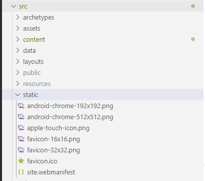

A favicon, short for "favorite icon," is the small image people see in browser tabs, bookmarks, and shortcuts. It makes your site easier to spot when the screen is crowded.

With so many platforms, devices, icon formats, and sizes to think about, it helps to use a generator instead of assembling every file by hand. A quick search for "favicon generator" turns up plenty of options.

I used [favicon.io](https://favicon.io) for this. [realfavicongenerator.net](https://realfavicongenerator.net/) would have worked too.

I started with a cropped square version of my profile picture, uploaded it to [favicon.io](https://favicon.io), downloaded the generated zip file, and copied its contents into the `static` folder of my Hugo site:



Next I copied the HTML snippet from the download page into `layouts/partials/head/custom.html`

```HTML
<link rel="apple-touch-icon" sizes="180x180" href="/apple-touch-icon.png">
<link rel="icon" type="image/png" sizes="32x32" href="/favicon-32x32.png">
<link rel="icon" type="image/png" sizes="16x16" href="/favicon-16x16.png">
<link rel="manifest" href="/site.webmanifest">
```

And that was it. The site picked up the new favicon right away.

References:  
[Add favicon in config.toml · Issue #42](https://github.com/CaiJimmy/hugo-theme-stack/issues/42#issuecomment-716052364)  
