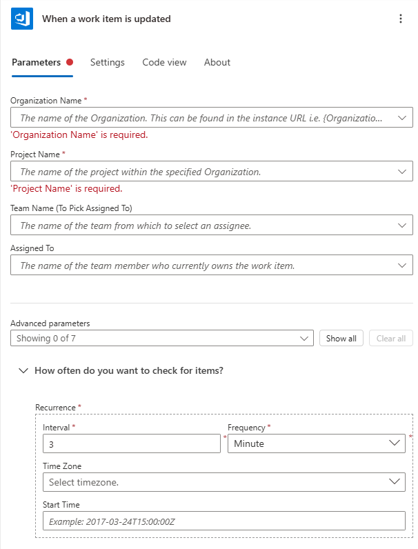
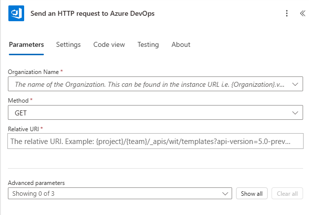
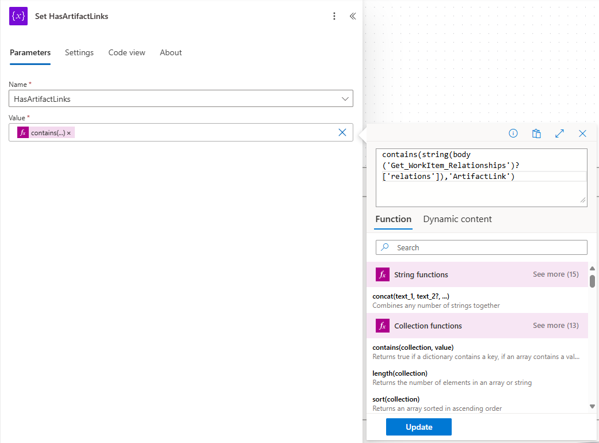
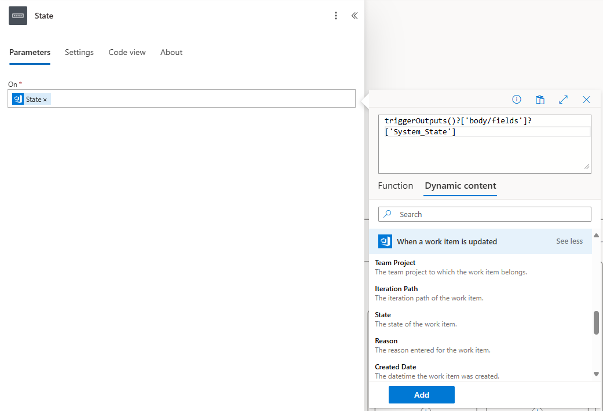
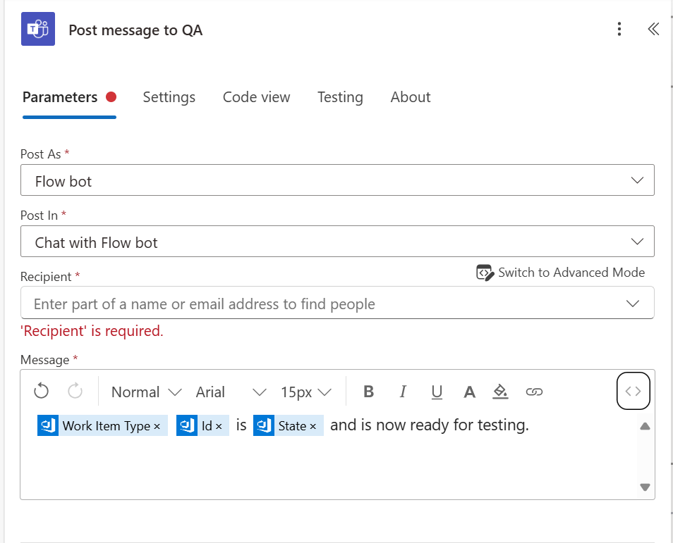
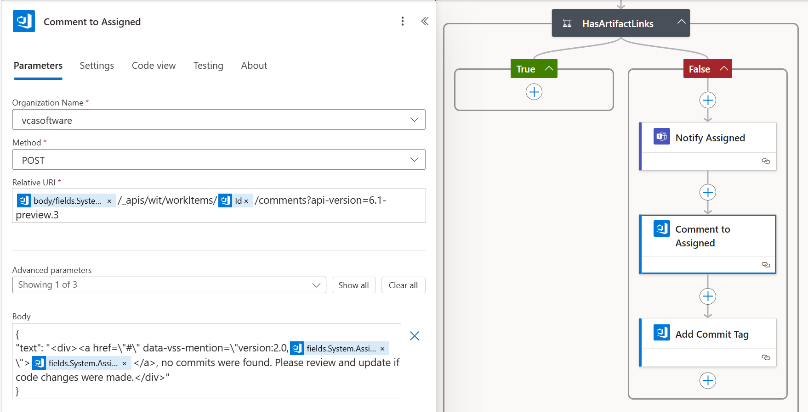
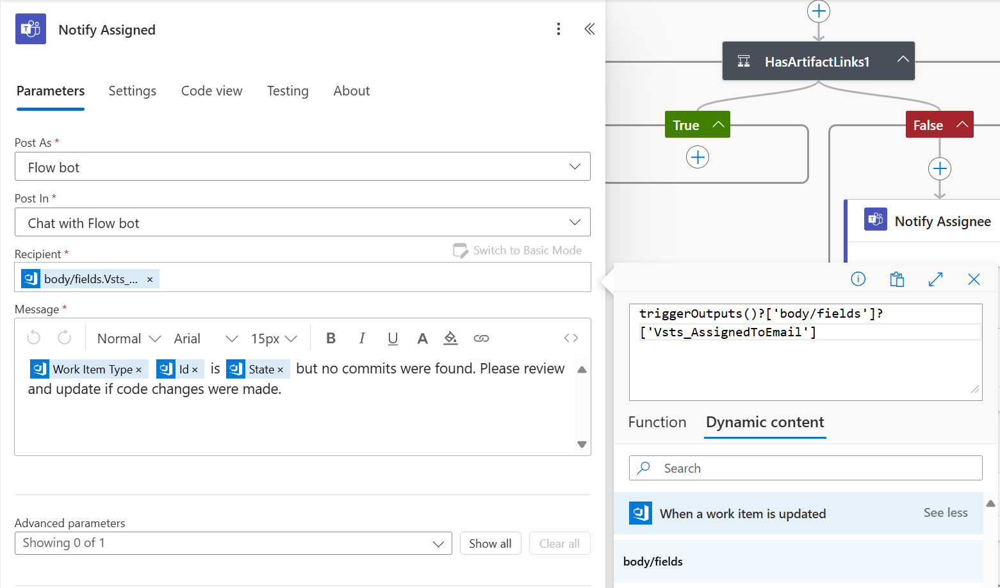
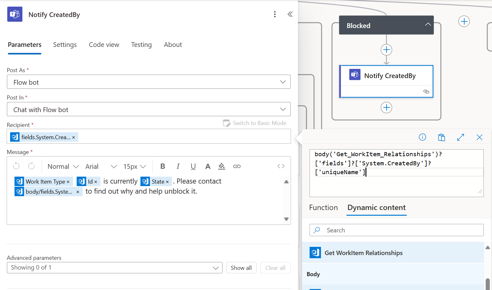

Managing work items in [Azure DevOps](https://learn.microsoft.com/en-us/azure/devops/?view=azure-devops) is crucial for efficient software development. To enhance communication and collaboration, I created a Power Automate flow that automatically notifies team members whenever a work item is updated. This post will guide you through the steps I took to create this flow.

### Why Use Power Automate for Azure DevOps?

[Power Automate](https://learn.microsoft.com/en-us/power-automate/) is a powerful tool that integrates seamlessly with Azure DevOps, automating tasks like sending notifications, updating items, or even triggering workflows. By automating notifications, you ensure that relevant team members are instantly informed about the status or changes in work items.

## Step 1: Setting Up the Trigger

To get started, I needed to create the trigger that fires whenever a work item in Azure DevOps is updated.

1. Head over to Power Automate and select **Create a new flow**.
1. Choose **Automated flow**, and for the trigger, select **When a work item is updated**.
1. Enter your Azure DevOps organization name and the project you’re working on.
    

This is the most basic part, but the rest of the flow will depend on what specific conditions you need the flow to respond to.

> **NOTE:** Please pay attention to the section _How often do you want to check for items?_. The interval specified here will need to match the interval used to determine state changes later.

## Step 2: Initialize Variables

To keep track of the work item’s state and artifact links, I initialized two variables:

- **LastTime:** This helps track the time interval between updates.
- **HasArtifactLinks:** This checks if any artifact links (commits, pull requests) are attached to the work item.

Here’s how to set up the variables:

1. Add a new **Initialize Variable** action.
1. Name the first variable **LastTime**. Set its type to `String` and its initial value to" `getPastTime(3, 'Minute')`.

    > **NOTE:** The number `3` here needs to match the value in the trigger as mentioned before.
1. Add a second **Initialize Variable** action, name this one `HasArtifactLinks`, set its type to `Boolean`, and default it to `false`.

## Step 3: Checking if the Work Item State Has Changed

Next, I wanted the flow to only proceed if the work item’s state had changed. To do this:

1. Add a Condition action.
1. In the left box, enter the expression:

    ```ruby
    triggerOutputs()?['body/fields']?['Microsoft_VSTS_Common_StateChangeDate']
    ```

1. Set the condition to `is equal to`.
1. In the right box, enter the expression:

    ```ruby
    triggerOutputs()?['body/fields']?['System_ChangedDate']
    ```

1. Add a line item to the condition
1. In the left box, enter the expression:

    ```ruby
    triggerOutputs()?['body/fields']?['Microsoft_VSTS_Common_StateChangeDate']
    ```

1. Set the condition to `is greater or equal to`.
1. In the right box, select the `LastTime` variable.
1. The complete expression should look like this:

    ```json
    "or": [
        {
        "equals": [
            "@triggerOutputs()?['body/fields']?['Microsoft_VSTS_Common_StateChangeDate']",
            "@triggerOutputs()?['body/fields']?['System_ChangedDate']"
        ]
        },
        {
        "greaterOrEquals": [
            "@triggerOutputs()?['body/fields']?['Microsoft_VSTS_Common_StateChangeDate']",
            "@variables('LastTime')"
        ]
        }
    ]
    ```

If the state has changed, the flow will proceed; otherwise, it will exit at this point.

## Step 4: Getting Work Item Relationships

To handle work item relationships (e.g., linking artifacts), I added the following steps:

1. Add an action **Send an HTTP request to Azure DevOps**.

    

1. Specify the same organization name as in the trigger.
1. Set the **Method** to `GET`.
1. Set the **Relative URI** to the following expression:

    ```ruby
    @{triggerOutputs()?['body/fields']?['System_TeamProject']}/_apis/wit/workitems/@{triggerOutputs()?['body/id']}?$expand=relations&api-version=6.1-preview.3
    ```

    > **NOTE:** The querystring paramater `$expand=relations` which is required for expanding related links in the response.

1. Rename this action **Get WorkItem Relationships**. We will use this name in subsequent steps when retrieving values from the output of this action.

This will retrieve the work item details and expand all related links, such as commits or pull requests. 

## Step 5: Set the HasArtifactLinks Flag

Once I had the relationships, I needed to update the HasArtifactLinks variable to true if any artifact links were found. Here's how:

1. Add an action **Set variable**:

    

1. Choose `HasArtifactLinks` variable from the drop down.
1. Set the **Value** to the following expression:

    ```ruby
    contains(string(body('Get_WorkItem_Relationships')?['relations']),'ArtifactLink')
    ```

    > **NOTE:** We are using the output from our previous step (in this case, "Get_WorkItem_Relationships" — use the UI to add dynamic content in the expression to make sure you'll have the right value). In addition, we are keeping things simple by converting the JSON to a string, and simply checking if it contains the text `"ArtifactLink"`.

This will set the variable `HasArtifactLinks` to true if there are any links of type **ArtifactLink**.

## Step 6: Handling Different Work Item States

Now comes the interesting part—handling different scenarios based on the work item state. Depending on whether the work item is Resolved, Closed, or Blocked, I wanted the flow to send notifications accordingly.

Here's how I handled it:

1. Add a new **Switch** action and set the Work item **State** as the input.

    

1. In the **Resolved** case, I send a notification to the QA team:

    - **Action:** Post a message in a chat or channel.
    - **Recipient:** Email address of the QA person/team.
    - **Message:**

        ```scss
        <a href="@{body('Get_WorkItem_Relationships')?['_links']?['html']?['href']}" class="editor-link">@{triggerOutputs()?['body/fields']?['System_WorkItemType']} @{triggerOutputs()?['body/id']}</a> is @{triggerOutputs()?['body/fields']?['System_State']} and is now ready for testing.
        ```

        

        This includes a hyperlink to the work item in the chat message

1. In the **Resolved** case, I also checked the `HasArtifactLinks` variable to determine if commits were linked to the work item. If the variable was false, I sent a message to the assigned user requesting a linked commit:

    - **Action:** Send an HTTP request to Azure DevOps.
    - **Relative URI:**

        ```kotlin
        @{triggerOutputs()?['body/fields']?['System_TeamProject']}/_apis/wit/workItems/@{triggerOutputs()?['body/id']}/comments?api-version=6.1-preview.3
        ```

    - **Body:**

        ```json
        {
            "text": "<div><a href=\"#\" data-vss-mention=\"version:2.0,@{body('Get_WorkItem_Relationships')?['fields']?['System.AssignedTo']?['id']}\">@{body('Get_WorkItem_Relationships')?['fields']?['System.AssignedTo']?['displayName']}</a>, no commits were found. Please review and update if code changes were made.</div>"
        }
        ```

        

    This mentioned the assigned user in a comment on the work item, which will trigger an email message.

1. In the **Closed** case, I checked the `HasArtifactLinks` variable to determine if commits were linked to the work item. If the variable was false, I sent a message to the assigned user requesting a linked commit:

    - **Action:** Post a message in a chat or channel.
    - **Recipient:**

        ```kotlin
        triggerOutputs()?['body/fields']?['Vsts_AssignedToEmail']
        ```

    - **Message:**

        ```scss
        <a href="@{body('Get_WorkItem_Relationships')?['_links']?['html']?['href']}" class="editor-link">@{triggerOutputs()?['body/fields']?['System_WorkItemType']} @{triggerOutputs()?['body/id']}</a> is @{triggerOutputs()?['body/fields']?['System_State']} but no commits were found. Please review and update if code changes were made.</p>
        ```

        

1. If the work item was **Blocked**, I posted a message to the creator of the work item to notify them of the block.

    - **Action:** Post a message in a chat or channel.
    - **Recipient:**

        ```kotlin
        body('Get_WorkItem_Relationships')?['fields']?['System.CreatedBy']?['uniqueName']
        ```

    - **Message:**

        ```scss
        <a href="@{body('Get_WorkItem_Relationships')?['_links']?['html']?['href']}" class="editor-link">@{triggerOutputs()?['body/fields']?['System_WorkItemType']} @{triggerOutputs()?['body/id']}</a> is currently @{triggerOutputs()?['body/fields']?['System_State']}. Please contact @{triggerOutputs()?['body/fields']?['System_AssignedTo']} to find out why and help unblock it.
        ```

        

By setting up this Power Automate flow, I no longer have to worry about manually tracking work item updates or notifying team members. Whether a work item is resolved, blocked, or closed, the flow ensures the right people get notified at the right time. Plus, with the artifact link checks, developers can easily review the associated commits and pull requests.

References:  
[Azure DevOps Services REST API Reference](https://learn.microsoft.com/en-us/rest/api/azure/devops/?view=azure-devops-rest-7.2)  
[Azure DevOps Connector](https://learn.microsoft.com/en-us/connectors/visualstudioteamservices)  
[Send an HTTP request to Azure DevOps](https://learn.microsoft.com/en-us/connectors/visualstudioteamservices/#send-an-http-request-to-azure-devops)  
[Microsoft Teams Connector](https://learn.microsoft.com/en-us/connectors/teams/?tabs=text1%2Cdotnet)  
[Post message in a chat or channel](https://learn.microsoft.com/en-us/connectors/teams/?tabs=text1%2Cdotnet#post-message-in-a-chat-or-channel)  
[Adding Notifications to MS Teams when Azure DevOps Work Items are Waiting using Power Automate](https://medium.com/@benjihuser/adding-notifications-to-ms-teams-when-azure-devops-work-items-are-waiting-using-power-automate-b5466eb1cae6)
