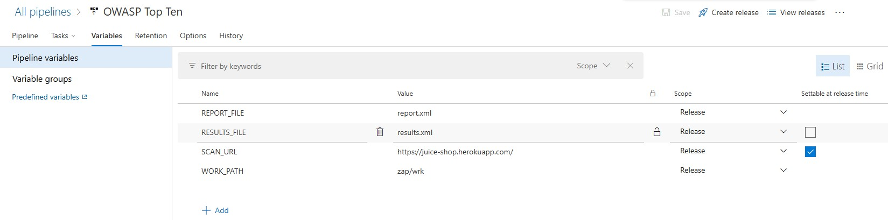
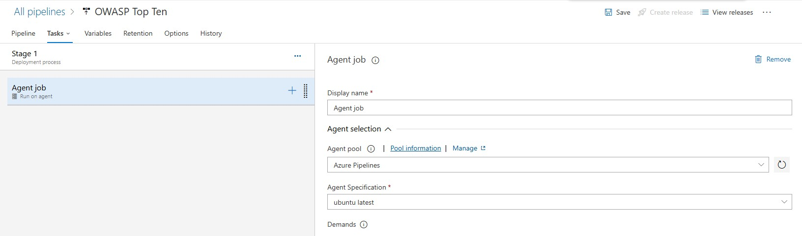
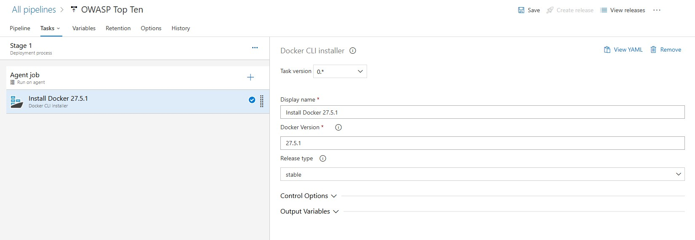
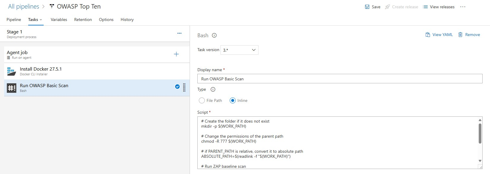
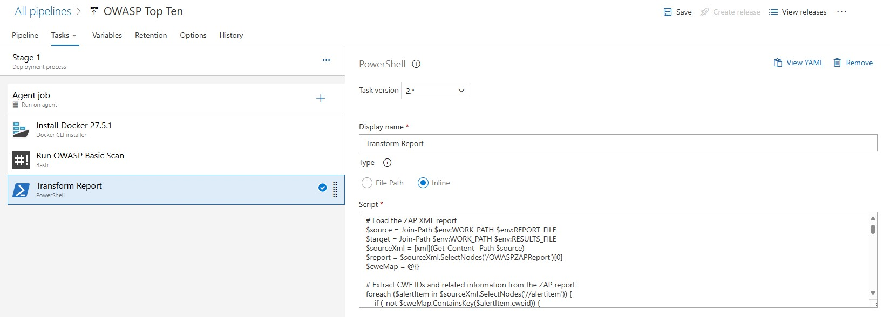
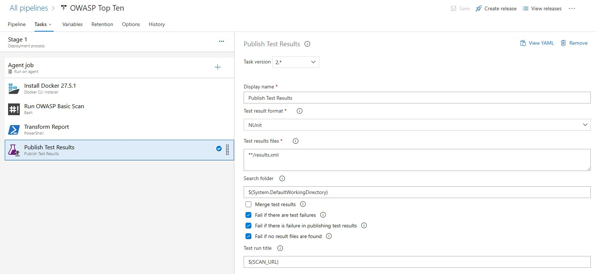
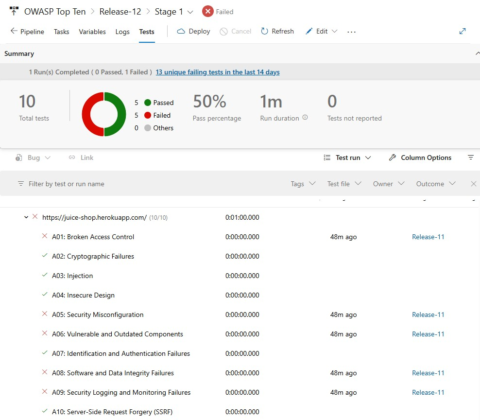

Security scanning should be part of the delivery flow, not an afterthought. In this post I show how I automated OWASP ZAP scans in Azure DevOps release pipelines and turned the findings into something teams can actually act on.

The approach uses a ZAP Docker container to run baseline scans, a PowerShell script to map findings to OWASP Top 10 categories and convert them to NUnit format, and the standard Azure DevOps publish-test-results task to surface vulnerabilities as visible test failures in your pipeline.

## Defining Pipeline Environment Variables

The process begins by defining pipeline variables that will be used by the pipeline tasks. Here is a screenshot of the pipeline variables configuration:



The following variables are defined:

- `SCAN_URL`: This is the website URL that will be scanned by the ZAP scanner.
- `REPORT_FILE`: This is the file name of the report that will be generated by the ZAP scanner.
- `RESULTS_FILE`: This is the NUnit formatted file that will be generated by the transformation task.
- `WORK_PATH`: This is the folder in which the `REPORT_FILE` and the `RESULTS_FILE` will be created.

## Defining the Agent Job

Next, it is important to define the correct parameters for the agent job. Since we are going to be running both Bash and PowerShell scripts, we will choose the `Azure Pipelines` agent pool and the `ubuntu-latest` agent specification as shown in the screen below:



## Installing Docker in the Agent Machine

In order to run docker commands, the docker engine will need to be installed on the agent machine. This is done by adding the [Docker CLI Installer](https://learn.microsoft.com/en-us/azure/devops/pipelines/tasks/reference/docker-installer-v0?view=azure-pipelines) task:



> **NOTE:** Visit the [Docker Engine release notes](https://docs.docker.com/engine/release-notes) page to find the latest version of the docker engine.

## Running the OWASP ZAP Docker container

The next step uses a pre-configured OWASP ZAP Docker container:



 Using this container, we can run baseline scans against our web applications to detect potential vulnerabilities.

Here's the full script for the baseline scan command:

```bash
# Create the folder if it does not exist
mkdir -p $(WORK_PATH)

# Change the permissions of the parent path
chmod -R 777 $(WORK_PATH)

# if PARENT_PATH is relative, convert it to absolute path
ABSOLUTE_PATH=$(readlink -f "$(WORK_PATH)")

# Run ZAP baseline scan
docker run --rm -v $ABSOLUTE_PATH:/zap/wrk/:rw -t zaproxy/zap-stable zap-baseline.py -t $(SCAN_URL) -x `basename "$(REPORT_FILE)"`

# Write output variable
echo "##vso[task.setvariable variable=reportFile;]$ABSOLUTE_PATH/$(REPORT_FILE)"

# Ensure the task completes successfully
true
```

This command mounts a working directory to store the results and scans your application’s URL for common vulnerabilities. The results are generated in an XML format by default and stored in a file defined in the `REPORT_FILE` variable and located in the folder defined by the `WORK_PATH` variable.

## Converting ZAP Results to NUnit Format

While the XML report is detailed, integrating its results into your pipeline can still be awkward. To make that easier, we’ll transform the ZAP results into NUnit format. NUnit is widely supported by CI/CD tools and makes test outcomes easier to inspect.

In addition, we are only interested in the Top Ten OWASP Vulnerabilities, so this step also filters outcomes by the Top 10 categories.



This is achieved using a custom PowerShell script. The script extracts key details from the ZAP XML report, maps vulnerabilities to the OWASP Top 10 categories, and converts the data into a structured NUnit report.

Here’s the script in action:

```powershell
# Load the ZAP XML report
$source = Join-Path $env:WORK_PATH $env:REPORT_FILE
$target = Join-Path $env:WORK_PATH $env:RESULTS_FILE
$sourceXml = [xml](Get-Content -Path $source)
$report = $sourceXml.SelectNodes('/OWASPZAPReport')[0]
$cweMap = @{}

# Extract CWE IDs and related information from the ZAP report
foreach ($alertItem in $sourceXml.SelectNodes('//alertitem')) {
    if (-not $cweMap.ContainsKey($alertItem.cweid)) {
        $cweMap[$alertItem.cweid] = @{
            name = $alertItem.name
            description = $alertItem.desc
            riskcode = $alertItem.riskcode
            confidence = $alertItem.confidence
            solution = $alertItem.solution
            stacktrace = ($alertItem.instances.instance | ForEach-Object {
                "$($_.method) - $($_.uri)"
            }) -join "`n"
        }
    }
}

# Map CWE IDs to OWASP Top 10 categories
$topTen = @{
    "A01: Broken Access Control" = @("22", "284", "285", "639", "862", "863", "276", "425", "430", "441", "454", "470", "501", "522", "639", "668", "703", "732", "749", "751", "804", "807", "834", "840", "841", "942", "1188", "1209", "1262", "1326", "1327", "1384", "1413", "1425")
    "A02: Cryptographic Failures" = @("259", "320", "321", "326", "327", "331", "338", "347", "400", "523", "760", "780", "787", "818", "916", "917", "939", "1172", "1174", "1192", "1220", "1241", "1277", "1295", "1313", "1320", "1337", "1362", "1363")
    "A03: Injection" = @("74", "77", "89", "91", "93", "94", "95", "97", "98", "99", "113", "114", "116", "117", "148", "150", "153", "155", "161", "165", "167", "182", "564", "601", "611", "643", "644", "917")
    "A04: Insecure Design" = @("333", "348", "352", "362", "368", "372", "384", "392", "400", "405", "406", "407", "408", "409", "418", "419", "420", "421", "442", "444", "445", "447", "451", "453", "455", "456", "457", "471", "472", "500", "602", "607", "608")
    "A05: Security Misconfiguration" = @("16", "209", "213", "275", "295", "460", "496", "497", "498", "499", "538", "541", "548", "554", "555", "565", "567", "588", "611", "612", "617", "651", "752", "760", "765", "766", "767", "799", "1002")
    "A06: Vulnerable and Outdated Components" = @("829", "937", "1035", "1104", "1213", "1261", "1330", "1333", "1341", "1342", "1344", "1345", "1351", "1382", "1416", "1436", "1437", "1438", "1439", "1440", "1441", "1442", "1444", "1445", "1446")
    "A07: Identification and Authentication Failures" = @("287", "288", "290", "294", "304", "521", "523", "613", "645", "804", "rao", "1028", "1067", "1069", "1093", "1094")
    "A08: Software and Data Integrity Failures" = @("20", "345", "353", "472", "494", "502", "353", "494", "502", "639", "829", "1287", "1292", "1293", "1297", "1331", "1332", "1333", "1335", "1336", "1337", "1340")
    "A09: Security Logging and Monitoring Failures" = @("223", "228", "532", "778", "779", "798", "804", "778", "779", "798", "117", "200", "223", "532", "778", "779", "798", "1009", "1053", "1073", "1094", "1223")
    "A10: Server-Side Request Forgery (SSRF)" = @("918", "919", "921", "922", "918", "919", "921", "922", "1021", "1022", "1023")
}

# Initialize NUnit report structure
$newXml = New-Object -TypeName System.Xml.XmlDocument
$xmlDeclaration = $newXml.CreateXmlDeclaration("1.0", "utf-8", $null)
$newXml.AppendChild($xmlDeclaration)

# Calculate start time based on generated time from the ZAP report
$duration = 60
$startTime = [datetime]::Now.AddMinutes(-1 * $duration)
$hostParts = $report.site.host.Split('.')
$subdomain = if ($hostParts.Length -gt 1) { $hostParts[0] } else { $report.site.host }

# Create the root element
# https://docs.nunit.org/articles/nunit/technical-notes/usage/Test-Result-XML-Format.html#test-run
$root = $newXml.CreateElement('test-run')
$root.SetAttribute("id", "$($env:RELEASE_RELEASEID)")
$root.SetAttribute("name", $subdomain)
$root.SetAttribute("fullname", $report.site.host)
$root.SetAttribute("engine-version", $report.version)
$root.SetAttribute("start-time", $startTime.ToString("ddd, dd MMM yyyy HH:mm:ss"))
$root.SetAttribute("end-time", $report.generated)
$root.SetAttribute("duration", [string]$duration)
$newXml.AppendChild($root)

# Create the test suite element
# https://docs.nunit.org/articles/nunit/technical-notes/usage/Test-Result-XML-Format.html#test-suite
$testSuite = $newXml.CreateElement('test-suite')
$testSuite.SetAttribute("type", "Assembly")
$testSuite.SetAttribute("id", "$($env:RELEASE_RELEASEID)-$($env:RELEASE_DEPLOYMENTID)")
$testSuite.SetAttribute("name", $subdomain)
$testSuite.SetAttribute("fullname", $report.site.host)
$testSuite.SetAttribute("testcasecount", [string]$topTen.Count)
$testSuite.SetAttribute("start-time", $startTime.ToString("ddd, dd MMM yyyy HH:mm:ss"))
$testSuite.SetAttribute("end-time", $report.generated)
$testSuite.SetAttribute("duration", [string]$duration)
$testSuite.SetAttribute("total", [string]$topTen.Count)
$testSuite.SetAttribute("asserts", [string]$topTen.Count)

$attachments = $newXml.CreateElement('attachments')
$attachment = $newXml.CreateElement('attachment')
$description = $newXml.CreateElement('description')
$description.InnerText = "Original OWASP Report"
# https://docs.nunit.org/articles/nunit/technical-notes/usage/Test-Result-XML-Format.html#filepath
$filePath = $newXml.CreateElement('filePath')
$filePath.InnerText = $(Resolve-Path $source).Path
$attachment.AppendChild($description)
$attachment.AppendChild($filePath)
$attachments.AppendChild($attachment)
$testSuite.AppendChild($attachments)

# Process alerts and map them to test cases
$count = 1
foreach ($key in ($topTen.Keys  | Sort-Object)) {
    # https://docs.nunit.org/articles/nunit/technical-notes/usage/Test-Result-XML-Format.html#test-case
    $testCase = $newXml.CreateElement('test-case')
    $testCase.SetAttribute("id", [string]$count)
    $testCase.SetAttribute("name", $key)
    $testCase.SetAttribute("fullname", $key)
    
    $hasFailure = $false

    $messageText = ""
    $stackTraceText = ""

    foreach ($cweId in $cweMap.Keys) {
        if ($topTen[$key] -contains $cweId) {
            $hasFailure = $true
            $messageText += "<h3>CWE-$($cweId): $($cweMap[$cweId].name)</h3><h4>Description:</h4><p>$($cweMap[$cweId].description)</p><h4>Solution:</h4><p>$($cweMap[$cweId].solution)</p>"
            $stackTraceText += $cweMap[$cweId].stacktrace
        }
    }
    
    if ($hasFailure) {
        $failure = $newXml.CreateElement('failure')
        $message = $newXml.CreateElement('message')
        $stackTrace = $newXml.CreateElement('stack-trace')

        $message.AppendChild($newXml.CreateCDataSection($messageText))
        $stackTrace.InnerText = $stackTraceText
        $failure.AppendChild($message)
        $testCase.AppendChild($failure)
        $testCase.AppendChild($stackTrace)
    }

    $testCase.SetAttribute("result", (&{if ($hasFailure) { "Failed" } else { "Passed" }}))
    $testSuite.AppendChild($testCase)
    $count++
}

$failedCount = ($testSuite.SelectNodes('test-case[@result="Failed"]')).Count
$testResult = (&{if ($failedCount -gt 0) { "Failed" } else { "Passed" }})

# update the test suite result
$testSuite.SetAttribute("result", $testResult)
$testSuite.SetAttribute("failed", $failedCount)
$testSuite.SetAttribute("passed", $topTen.Count - $failedCount)

# combine all the failure messages
$failures = ($testSuite.SelectNodes('test-case/failure/message') | ForEach-Object { $_.InnerText }) -join "`n"

# Append failure message to the test suite
if ($testResult -eq "Failed") {
    $failure = $newXml.CreateElement('failure')
    $message = $newXml.CreateElement('message')

    $message.AppendChild($newXml.CreateCDataSection($failures))
    $failure.AppendChild($message)
    $testSuite.AppendChild($failure)
}

# Append the test suite to the root
$root.AppendChild($testSuite)

# update the test run result
$root.SetAttribute("result", $testResult)
$root.SetAttribute("failed", $failedCount)
$root.SetAttribute("passed", $topTen.Count - $failedCount)

# Save the NUnit report
$newXml.Save($target)

# Display the full path to the generated report
Write-Host "##vso[task.setvariable variable=resultsFile;]$target"
```

### Key Features of the Script

- **Alert Aggregation:** Gathers and organizes vulnerability data from ZAP results.
- **OWASP Mapping:** Links CWEs from ZAP alerts to OWASP Top 10 categories. For a full list of CWE IDs and their mappings to the OWASP Top 10 categories, see the official OWASP documentation: [OWASP Top Ten Mapping](https://owasp.org/www-project-top-ten/).
- **NUnit Format Conversion:** Outputs the data in NUnit format for easy integration with Azure DevOps.

## Integrating NUnit Results with Azure DevOps

Once the script generates the NUnit report (`results.xml`), it can be published in Azure DevOps as a test result. Add a task in your pipeline to publish the report:



This step ensures that vulnerabilities are tracked as test failures, making them highly visible to your development and security teams.



### What this gets you

By integrating OWASP ZAP scans with Azure DevOps, security findings show up as test failures in the same interface as the rest of your pipeline results. The PowerShell script handles the CWE-to-OWASP mapping and NUnit conversion, so you do not have to dig through raw XML to understand what failed.

One thing I appreciate even more now than when I first wrote this post is that DAST automation is only one part of a strong DevSecOps loop. OWASP ZAP gives us runtime-facing feedback, but the workflow becomes even more powerful when it sits beside static analysis, issue routing, and remediation paths that developers can act on without leaving their normal delivery flow.

I explored that next step in [How I Run SonarQube in My Own CI Pipeline (And Let AI Fix What It Finds)](/blog/2026/03/05/how-i-run-sonarqube-in-my-own-ci-pipeline-and-let-ai-fix-what-it-finds/). If this post shows one generation of automated AppSec reporting, that newer post shows how I now think about turning findings directly into reviewable engineering work.

References:

- [OWASP ZAP Docker Documentation](https://www.zaproxy.org/docs/docker/about/)
- [ZAP Baseline Scan](https://www.zaproxy.org/docs/docker/baseline-scan/)
- [OWASP Top Ten Mapping](https://owasp.org/www-project-top-ten/)
- [GitHub - OWASP/Top10: Official OWASP Top 10 Document Repository](https://github.com/OWASP/Top10)
- [Azure DevOps Pipelines](https://docs.microsoft.com/en-us/azure/devops/pipelines/?view=azure-devops)
- [NUnit XML Format](https://github.com/nunit/docs/wiki/XML-Formats)
- [PowerShell HashTables](https://learn.microsoft.com/en-us/powershell/module/microsoft.powershell.core/about/about_hash_tables?view=powershell-7.4)
- [Everything you wanted to know about hashtables](https://learn.microsoft.com/en-us/powershell/scripting/learn/deep-dives/everything-about-hashtable?view=powershell-7.4)
