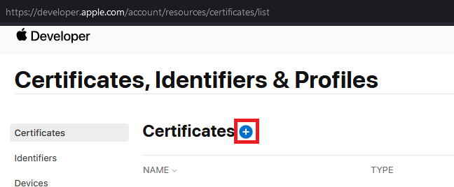
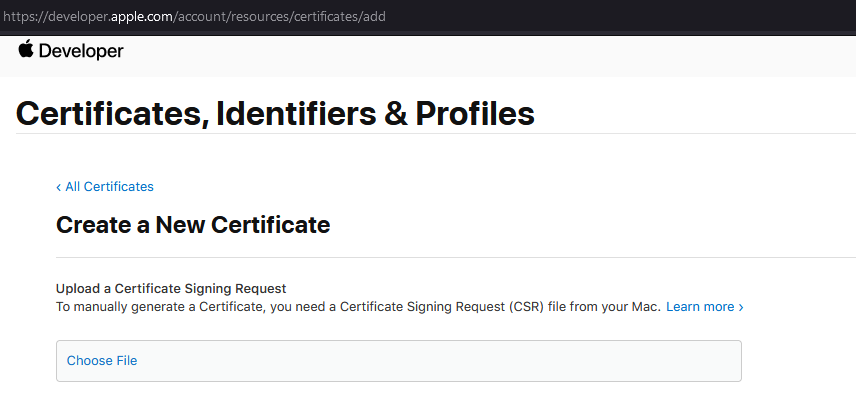
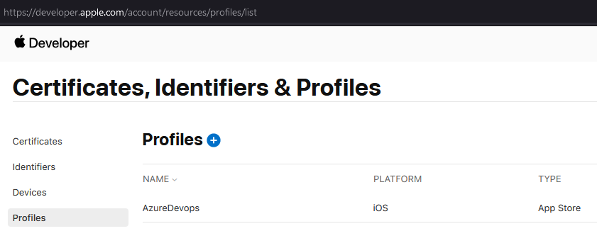
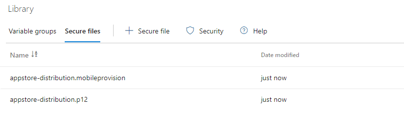
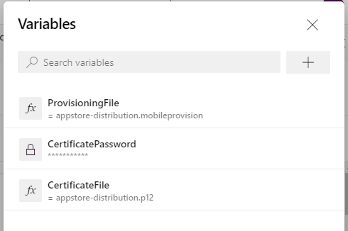

A Distribution Certificate is used to identify a developer for the purpose of installing and testing apps on iOS devices. Certificates can be obtained from Apple's iOS Provisioning Portal and a Certificate Signing Request (CSR) file needs to be generated first.

The process for generating a CSR differs depending on your choice of operating system. In this post, I'll cover how to generate Certificate Signing Request (CSR) file on Windows as well as how to use the generated certificate and provisioning profile to build and sign an iOS application in Azure DevOps.

1. First open a PowerShell window, then run the following command to create a private key:

    ```powershell
    openssl genrsa -out appstore-distribution.key 2048
    ```

2. Next, run the following command to generate the Certificate Signing Request (CSR) file using the previously created private key:

    ```powershell
    openssl req -new -key appstore-distribution.key -out appstore-distribution.csr  -subj "/emailAddress=devops@example.com, CN=Example, C=CA"
    ```

3. Next, go to the [Apple Developer Portal](https://developer.apple.com/account/resources/certificates/list) and click the "+" button next to "Certificates":

    

4. Choose the type of certificate you want to create, then click "Continue"

5. Upload the Certificate Signing Request (CSR) file generated earlier and click "Continue":

    

6. A certificate will be generated and will be available for download. click "Download the Certificate".

7. In order to sign the application in Azure DevOps, we need the certificate in `.p12` format. So to convert the `.cer` file to `.p12`, execute the following commands:

    ```powershell
    openssl x509 -in appstore-distribution.cer -inform DER -out appstore-distribution.pem -outform PEM
    ```

    followed by:

    ```powershell
    openssl pkcs12 -export -out appstore-distribution.p12 -inkey appstore-distribution.key -in appstore-distribution.pem
    ```

    This will prompt for a password. Please provide a password and store it in a safe place. This password will be needed when signing the application.

8. Next, we need to generate a provisioning profile by going back to the [Apple Developer Portal](https://developer.apple.com/account/resources/profiles/list) and clicking "+" next to "Profiles":

    

9. Choose the type of Provisioning Profile you want to create, then click "Continue"

10. Select the App ID you would like associated with the provisioning profile, then click "Continue".

11. Select the certificate we created earlier, then click "Continue".

12. Give the provisioning profile a name, then click "Generate". You will be able to download the provisioning profile after it is generated.

13. Upload the P12 certificate and provisioning profile to Azure DevOps [Secure Files Library](https://docs.microsoft.com/en-us/azure/devops/pipelines/library/secure-files?view=azure-devops). During upload, your certificate will be encrypted and securely stored.

    

14. Create a new pipeline, or go to the pre-existing pipeline if one already exists.

15. Go to the Variables tab and add the following variables:

    * `CertificateFile`: Set the value to `appstore-distribution.p12` (or whatever name you gave to your P12 certificate file in step #13).  
    * `CertificatePassword`: Set the value to the password you set in step #7 above. Be sure check "Keep this value secret". This will secure your password and obscure it in logs.
    * `ProvisioningFile`: Set the value to `appstore-distribution.mobileprovision` (or whatever name you gave your provisioning file in step #13).

    

16. Update the `azure-pipelines.yml` using the following example:

    ```yaml
    name: $(Build.BuildId)
    trigger:
    - main
    - dev

    pool:
    vmImage: 'macOS-latest'

    variables:
    - name: configuration
      value: Release
    - name: sdk
      value: iphoneos
    - name: scheme
      value: Example
    - name: workspace
      value: Example.xcworkspace
    - name: plistFile
      value: Info.plist

    steps:
    - task: Cache@2
      inputs:
        key: 'pods | "$(Agent.OS)" | Podfile.lock'
        path: 'Pods'
        cacheHitVar: 'PODS_CACHE_RESTORED'

    - task: CocoaPods@0
      displayName: 'pod install using the CocoaPods task with defaults'
      inputs:
        forceRepoUpdate: true  
      condition: ne(variables.PODS_CACHE_RESTORED, 'true')

    - task: InstallAppleCertificate@2
      inputs:
        certSecureFile: '$(certificateFile)'
        certPwd: '$(CertificatePassword)'
        keychain: 'temp'
        deleteCert: true

    - task: InstallAppleProvisioningProfile@1
      inputs:
        provisioningProfileLocation: 'secureFiles'
        provProfileSecureFile: '$(provisioningFile)'

    - task: CmdLine@2
      displayName: 'Set Build Number'
      inputs:
        script: '/usr/libexec/PlistBuddy -c "Set :CFBundleVersion $(Build.BuildId)" $(Build.SourcesDirectory)/$(scheme)/$(plistFile)'

    - task: Xcode@5
      inputs:
        actions: 'build'
        configuration: '$(configuration)'
        sdk: '$(sdk)'
        xcWorkspacePath: '$(workspace)'
        scheme: '$(scheme)'
        packageApp: true
        signingOption: 'manual'
        signingIdentity: '$(APPLE_CERTIFICATE_SIGNING_IDENTITY)'
        provisioningProfileUuid: '$(APPLE_PROV_PROFILE_UUID)'

    - task: CopyFiles@2
      inputs:
        contents: '**/*.ipa'
        targetFolder: '$(build.artifactStagingDirectory)'

    - task: PublishBuildArtifacts@1
      displayName: 'Publish artifact'
      condition: succeededOrFailed()
    ```

References:  
[Convert .cer to .p12](https://stackoverflow.com/a/42196304)  
[Build, test, and deploy Xcode apps](https://docs.microsoft.com/en-us/azure/devops/pipelines/ecosystems/xcode?view=azure-devops)  
[Sign your mobile app](https://docs.microsoft.com/en-us/azure/devops/pipelines/apps/mobile/app-signing?view=azure-devops&tabs=apple-install-during-build)