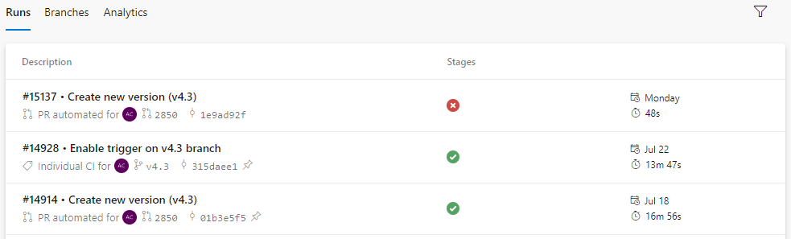
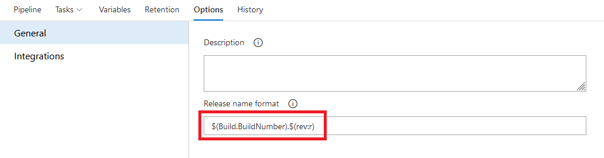

After migrating a Azure DevOps project from one organization to another, I ran into an issue where the automatically generated build identifiers were out of sync. What do I mean by that? Well, in the old organization, the most recent build id was something like `14928`. In Azure DevOps, every build has two primary identifiers, `Build.BuildId` and `Build.BuildNumber`:

- `Build.BuildId`: The ID of the record for the completed build.
- `Build.BuildNumber`: The name of the completed build, also known as the run number. 

It is possible to specify [what is included](https://learn.microsoft.com/en-us/azure/devops/pipelines/process/run-number) in the run number by leveraging any of the predefined [tokens](https://learn.microsoft.com/en-us/azure/devops/pipelines/process/run-number?view=azure-devops&tabs=yaml#tokens). The default value for run number is `$(Date:yyyyMMdd).$(Rev:r)`.

The easiest way to customize the build/pipeline run number is to specify the `name` property at the root level of the YAML file, and in my pipeline I had it define this way:

```yaml
name: $(Build.BuildId)
trigger:
- master
- v4.3
- versioning

pool:
  vmImage: 'macOS-latest'
```

This basically uses the `BuildId` which is an integer as the `BuildNumber` and shows up this way in the pipeline history:



This also allows me to reference the build number either during the build process or the release process:



Now, the issue I was facing was that I simply needed to add the number `14928` to my `BuildId` and use that as my `BuildNumber`. Unfortunately, Azure Devops does not support mathematical calculations at this stage of of the release pipeline process. As it turns out, mathematical calculations can only be done in tasks running on an agent.

So, with the help of Stack Overflow, this is the solution I eventually came up with:

1. Create a pipeline variable to hold your base build number.
2. Add a task to add the base build number to the current build id.
3. Set the build number to the calculated value

```yaml
steps:
- task: Bash@3
  displayName: 'Update Build Number'
  inputs:
    targetType: 'inline'
    script: |
      # create new variable holding sum of the two numbers
      newBuildNumber=$(( $(baseBuildNumber) + $(Build.BuildId) ))

      # display the sum
      echo "New Build Number: $newBuildNumber"

      # update the pipeline build number
      echo "##vso[build.updatebuildnumber]$newBuildNumber"
  condition: always()
```

Hope that proves helpful to you too, dear reader.

References:  
[Use predefined variables](https://learn.microsoft.com/en-us/azure/devops/pipelines/build/variables?view=azure-devops&tabs=yaml)  
[Arithmetic - Bash Scripting Tutorial](https://ryanstutorials.net/bash-scripting-tutorial/bash-arithmetic.php)  
[Argument string to integer in bash](https://unix.stackexchange.com/a/232386)  
[Build variables (DevOps Services)](https://learn.microsoft.com/en-us/azure/devops/pipelines/build/variables?view=azure-devops&tabs=yaml#build-variables-devops-services)  
[Azure devops - build number vs build id](https://stackoverflow.com/questions/67481676/azure-devops-build-number-vs-build-id)  
[UpdateBuildNumber: Override the automatically generated build number](https://learn.microsoft.com/en-us/azure/devops/pipelines/scripts/logging-commands?view=azure-devops&tabs=bash#updatebuildnumber-override-the-automatically-generated-build-number)  