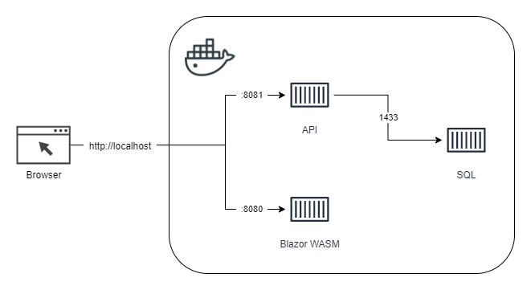
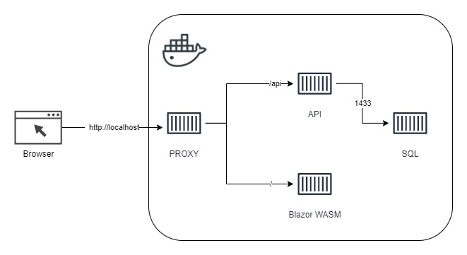

This is a continuation from my previous posts; [Dockerizing Blazor Wasm Application]()

The previous setup was a follows:


One drawback of this setup was that both the SPA service and the API service had to expose ports in order to be accessible and the ports had to be different. I didn't like that very much and for my learning purposes, I set out to figure out how to accomplish the following setup:

  

The first task was to figure out how to configure NGINX to forward requests to multiple back-end services on the same port. After much research, this is the `nginx.conf` I eventually came up with:

```conf
worker_processes 1;
  
events { worker_connections 1024; }

http {

    sendfile on;

    upstream spa-service {
        server SPA_SERVICE;
    }

    upstream api-service {
        server API_SERVICE;
    }
    
    # https://www.bogotobogo.com/DevOps/Docker/Docker-Compose-Nginx-Reverse-Proxy-Multiple-Containers.php
    proxy_set_header   Host $host;
    proxy_set_header   X-Real-IP $remote_addr;
    proxy_set_header   X-Forwarded-For $proxy_add_x_forwarded_for;
    proxy_set_header   X-Forwarded-Host $server_name;
    
    server {
        listen PORT;
 
        location / {
            proxy_pass         http://spa-service/;
            proxy_redirect     off;
        }
 
        # https://stackoverflow.com/a/53354944
        location ~* /Api/v1\.0/(.*) {
            # https://stackoverflow.com/a/8130872
            proxy_pass         http://api-service/Api/v1.0/$1$is_args$args;
            proxy_redirect     off;
            # https://docs.microsoft.com/en-us/aspnet/core/host-and-deploy/linux-nginx?view=aspnetcore-5.0
            proxy_http_version 1.1;
            proxy_set_header   Upgrade $http_upgrade;
            proxy_set_header   Connection keep-alive;
            proxy_cache_bypass $http_upgrade;
            proxy_set_header   X-Forwarded-Proto $scheme;
        }
    }
}
```

The tricky part was to ensure that only traffic intended for the SPA service was routed there. Somehow, I could not get it to work using just the path directive. I had to resort to regex to get it to work.

Next, I created a `configure-environment.sh` script very similar to the previous article:

```sh
#!/bin/sh  

# replace the placeholders in the nginx congfiguration file  
# https://stackoverflow.com/a/23134318
sed -i -e "s|API_SERVICE|${API_SERVICE}|g" /etc/nginx/nginx.conf
sed -i -e "s|SPA_SERVICE|${SPA_SERVICE}|g" /etc/nginx/nginx.conf
sed -i -e 's/PORT/'"${PORT}"'/g' /etc/nginx/nginx.conf
```

Details of the configuration settings are clearly outlined in the referenced articles.

Next, the `Dockerfile`:

```dockerfile
FROM nginx:alpine AS runtime

# copy startup commands
COPY configure-environment.sh /docker-entrypoint.d/
RUN chmod +x /docker-entrypoint.d/configure-environment.sh

# https://www.bogotobogo.com/DevOps/Docker/Docker-Compose-Nginx-Reverse-Proxy-Multiple-Containers.php
COPY nginx.conf /etc/nginx/nginx.conf

ENV SPA_SERVICE=spa:8080 
ENV API_SERVICE=api:8080
ENV PORT=8080

EXPOSE 8080

WORKDIR /home/site/wwwroot
```

Finally, the `docker-compose.yml` to tie it all together:

```yaml
# https://docs.docker.com/compose/compose-file/compose-file-v3/
version: "3"

services:
  proxy:
    build:
      context: .
      dockerfile: Dockerfile
    image: business/proxy:latest
    container_name: business-proxy
    environment:
      - SPA_SERVICE=spa:8080
      - API_SERVICE=api:8080
    # https://docs.docker.com/compose/startup-order/
    depends_on:
      - spa
      - api
    restart: always
    ports:
      - 80:8080
```

References:  
[DOCKER COMPOSE : NGINX REVERSE PROXY WITH MULTIPLE CONTAINERS](https://www.bogotobogo.com/DevOps/Docker/Docker-Compose-Nginx-Reverse-Proxy-Multiple-Containers.php)  
[Host ASP.NET Core on Linux with Nginx](https://docs.microsoft.com/en-us/aspnet/core/host-and-deploy/linux-nginx?view=aspnetcore-5.0)  
["proxy_pass" cannot have URI part in location given by regular expression](https://stackoverflow.com/a/53354944)  
[How can query string parameters be forwarded through a proxy_pass with nginx?](https://stackoverflow.com/a/8130872)  
[Environment variable substitution in sed](https://stackoverflow.com/a/23134318)