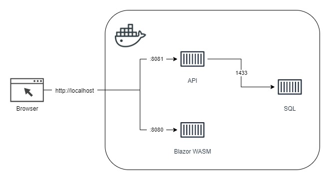
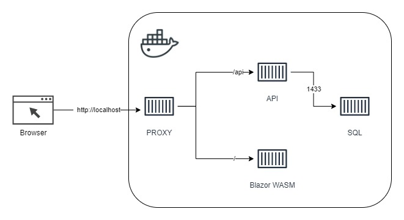

This is a continuation of my previous post, [Dockerizing Blazor Wasm Application]().

The previous setup looked like this:


One drawback of that setup was that both the SPA service and the API service had to expose different ports to be reachable. I wanted something cleaner for local development, so I set out to make this work:

  

The first task was figuring out how to configure NGINX to forward requests to multiple backend services on the same port. After a fair amount of reading, this is the `nginx.conf` I ended up with:

```conf
worker_processes 1;
  
events { worker_connections 1024; }

http {

    sendfile on;

    upstream spa-service {
        server SPA_SERVICE;
    }

    upstream api-service {
        server API_SERVICE;
    }
    
    # https://www.bogotobogo.com/DevOps/Docker/Docker-Compose-Nginx-Reverse-Proxy-Multiple-Containers.php
    proxy_set_header   Host $host;
    proxy_set_header   X-Real-IP $remote_addr;
    proxy_set_header   X-Forwarded-For $proxy_add_x_forwarded_for;
    proxy_set_header   X-Forwarded-Host $server_name;
    
    server {
        listen PORT;
 
        location / {
            proxy_pass         http://spa-service/;
            proxy_redirect     off;
        }
 
        # https://stackoverflow.com/a/53354944
        location ~* /Api/v1\.0/(.*) {
            # https://stackoverflow.com/a/8130872
            proxy_pass         http://api-service/Api/v1.0/$1$is_args$args;
            proxy_redirect     off;
            # https://docs.microsoft.com/en-us/aspnet/core/host-and-deploy/linux-nginx?view=aspnetcore-5.0
            proxy_http_version 1.1;
            proxy_set_header   Upgrade $http_upgrade;
            proxy_set_header   Connection keep-alive;
            proxy_cache_bypass $http_upgrade;
            proxy_set_header   X-Forwarded-Proto $scheme;
        }
    }
}
```

The tricky part was making sure only the traffic intended for the SPA service was routed there. I could not get the path directive alone to do what I wanted, so I used regex.

Next, I created a `configure-environment.sh` script very similar to the previous article:

```sh
#!/bin/sh  

# replace the placeholders in the nginx congfiguration file  
# https://stackoverflow.com/a/23134318
sed -i -e "s|API_SERVICE|${API_SERVICE}|g" /etc/nginx/nginx.conf
sed -i -e "s|SPA_SERVICE|${SPA_SERVICE}|g" /etc/nginx/nginx.conf
sed -i -e 's/PORT/'"${PORT}"'/g' /etc/nginx/nginx.conf
```

The referenced articles cover the configuration details well.

Next, the `Dockerfile`:

```dockerfile
FROM nginx:alpine AS runtime

# copy startup commands
COPY configure-environment.sh /docker-entrypoint.d/
RUN chmod +x /docker-entrypoint.d/configure-environment.sh

# https://www.bogotobogo.com/DevOps/Docker/Docker-Compose-Nginx-Reverse-Proxy-Multiple-Containers.php
COPY nginx.conf /etc/nginx/nginx.conf

ENV SPA_SERVICE=spa:8080 
ENV API_SERVICE=api:8080
ENV PORT=8080

EXPOSE 8080

WORKDIR /home/site/wwwroot
```

Finally, the `docker-compose.yml` to tie it all together:

```yaml
# https://docs.docker.com/compose/compose-file/compose-file-v3/
version: "3"

services:
  proxy:
    build:
      context: .
      dockerfile: Dockerfile
    image: business/proxy:latest
    container_name: business-proxy
    environment:
      - SPA_SERVICE=spa:8080
      - API_SERVICE=api:8080
    # https://docs.docker.com/compose/startup-order/
    depends_on:
      - spa
      - api
    restart: always
    ports:
      - 80:8080
```

References:  
[DOCKER COMPOSE : NGINX REVERSE PROXY WITH MULTIPLE CONTAINERS](https://www.bogotobogo.com/DevOps/Docker/Docker-Compose-Nginx-Reverse-Proxy-Multiple-Containers.php)  
[Host ASP.NET Core on Linux with Nginx](https://docs.microsoft.com/en-us/aspnet/core/host-and-deploy/linux-nginx?view=aspnetcore-5.0)  
["proxy_pass" cannot have URI part in location given by regular expression](https://stackoverflow.com/a/53354944)  
[How can query string parameters be forwarded through a proxy_pass with nginx?](https://stackoverflow.com/a/8130872)  
[Environment variable substitution in sed](https://stackoverflow.com/a/23134318)